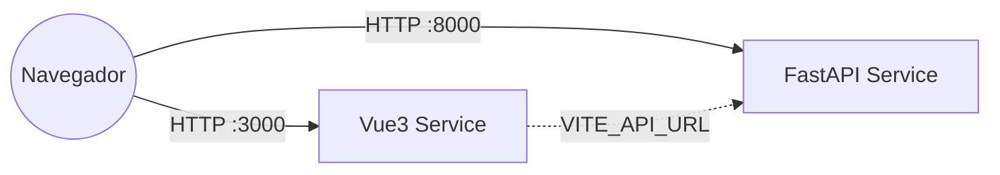

# Arquitectura de Integración

Este documento detalla el protocolo de comunicación entre el Cliente (Frontend) y el Servidor (Backend).

## Diagrama de Comunicación

## Configuración de Red

### 1. Backend (API)

* **Puerto Interno:** 8000
* **CORS (Seguridad):** Restringido explícitamente mediante la variable `FRONTEND_ORIGINS`. Solo acepta peticiones del origen definido, rechazando tráfico no autorizado.
* **Health Check:** `GET /` responde `{ status: "ok", service: "dashboard-backend" }`.

### 2. Frontend (Cliente)

* **Puerto Interno:** 3000
* **Descubrimiento de API:** No hardcodeamos URLs. Se utiliza `import.meta.env.VITE_API_URL` inyectada desde `docker-compose.yaml`.
* **Validación:** Se dispone de una herramienta de diagnóstico en `/sys-check`.

## Herramientas de Diagnóstico

### SysCheck (`/sys-check`)

Componente nativo para validar la conectividad End-to-End.

* **Ubicación:** `src/pages/SysCheck.vue`
* **Funcionalidad:** Realiza un handshake con el Backend y valida:
    1. Resolución DNS/Puerto.
    2. Permisos CORS.
    3. Integridad de respuesta JSON.
* **Override de Ruta:** Accesible vía `/sys-check` (kebab-case) aunque el archivo sea `SysCheck.vue` (PascalCase).
